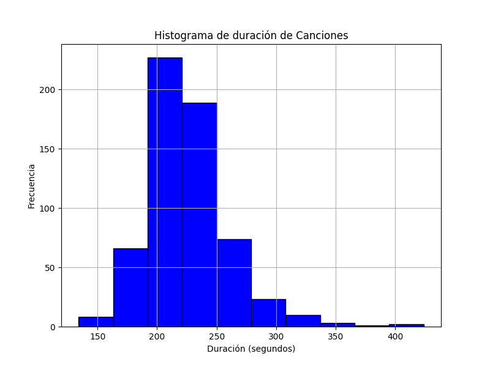

# Repositorio para el Curso UCA #

Este repositorio contiene el análisis de datos para el ejercicio final del curso UCA. Se enfoca en el dataset "top10s.csv", que incluye información sobre canciones populares como título, artista, género, año, BPM, energía, duración, popularidad, entre otros.
Estructura del Repositorio

    main.py: Script principal que carga los datos, genera estadísticas y crea un histograma de la duración de las canciones.
    data/: Datasets.
        top10s.csv: Archivo CSV con los datos de canciones top 10s.
    hist_duracion.png: Histograma de la duración de las canciones.
    README.md: Este archivo.

Análisis Realizado en Python

Se utilizó Python con Pandas y Matplotlib para analizar el dataset.

## Histograma de Duración de Canciones ##

El siguiente histograma muestra la distribución de la duración de las canciones en segundos. La mayoría de las canciones duran entre 200 y 300 segundos.

DOI de Zenodo:

[Inserte DOI aquí, ej. https://doi.org/Y/X]
